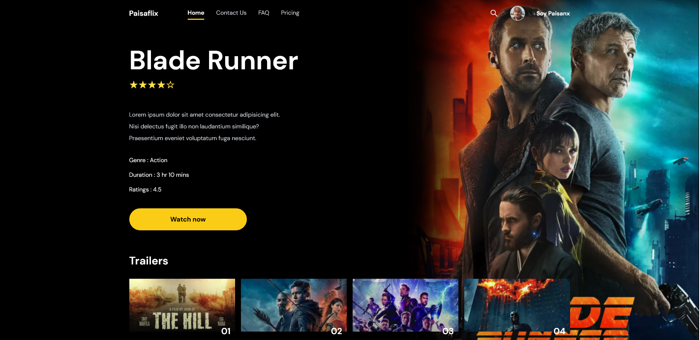

# Paisaflix - Challenge

A movie page that allows users to navigate between pages and by clicking on each of the images in the Featured section, display the corresponding movie in a new route.

### What I learned

My first Next.js 13 app in which I was able to practice concepts such as:

- New /app directory.
- New file-system based router.
- Loading UI for a specific part.
- Server components & client components.
- Fetching Data with Server Components.
- <Link> component.
- New optimized Image component.
- @next/font to optimize fonts.

### Screenshot

### Links

- Live Site URL: [Here](https://paisaflix-challenge.vercel.app/)

### Built with

- Semantic HTML5 markup
- CSS custom properties
- Flexbox
- Grid
- Mobile-first workflow
- [React](https://reactjs.org/) - JS library
- [Next](https://beta.nextjs.org/docs) - React framework
- [TailwindCSS](https://tailwindcss.com/) - For styles

## Author

- Website - [Marcos Valentín Fitzsimons](https://marcosfitzsimons-portfolio.vercel.app/)
